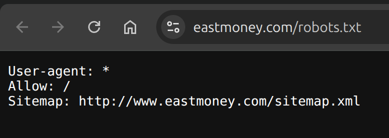

# a small project for data analyse

### requirement:

```
certifi==2025.11.12
charset-normalizer==3.4.4
contourpy==1.1.1
cycler==0.12.1
fonttools==4.57.0
idna==3.11
importlib_resources==6.4.5
kiwisolver==1.4.7
matplotlib==3.7.5
narwhals==1.42.1
numpy==1.24.4
packaging==25.0
pandas==2.0.3
pillow==10.4.0
plotly==6.5.0
py4j==0.10.9.7
pyarrow==17.0.0
pyparsing==3.1.4
pyspark==3.5.7
python-dateutil==2.9.0.post0
pytz==2025.2
requests==2.32.4
seaborn==0.13.2
six==1.17.0
tzdata==2025.2
urllib3==2.2.3
zipp==3.20.2

```

use conda, an open source package management system and environment management system
python version 3.8  
linux os(ubuntu24.04 is development env)

### attention:  

check the website [eastmoney](https://www.eastmoney.com/robots.txt)'s robots.txt is ok for web spider  
in 2025-12-16 is ok  


### usage:

The data interface may become unusable at any time.

open project and run `pip install -r requirement.txt` in terminal to install moudule  

Make sure you have a data folder in your project root directory. if not, please create. 

just run python main.py  

check the data/output dir, you will find some image  

in data/diagram will generate three html, use browser open it


